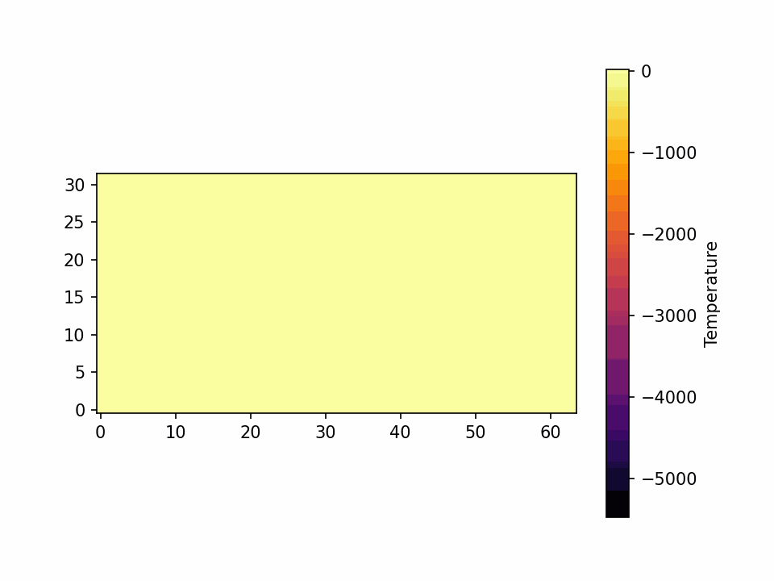

# Finite Difference Solver for the 2D Poisson Equation

## Overview

This project implements a finite difference solver for the 2D Poisson equation with mixed boundary conditions.

The system models steady-state heat distribution in a rectangular domain with:

- Dirichlet boundary conditions on left and right edges
- Robin and Neumann boundary conditions on top and bottom
- Constant volumetric source term

The solution is computed iteratively until convergence.

---

## Numerical Method

- Spatial discretization using second-order finite differences
- Uniform grid
- Iterative relaxation method (Jacobi-style update)
- Convergence criterion based on L2 norm

---

## Equation

∇²T = -f

with mixed boundary conditions.

---

## Results

The solver was tested for increasing spatial resolutions (8x4, 16x8, 32x16, 64x32).

For each resolution:

- The solution converges under an L2-norm stopping criterion.
- Computational time increases approximately with grid size.
- The temperature distribution stabilizes into a smooth steady-state profile consistent with Poisson behavior under mixed boundary conditions.

Higher grid resolutions produce smoother spatial gradients and improved numerical accuracy, at the cost of increased computational time.

Example output includes:
- 2D temperature field visualization
- Resolution scaling comparison

## Requirements

- Python 3.x
- NumPy
- Matplotlib

---

## Author

Esther Menéndez
BSc Physics

## Relaxation Process

